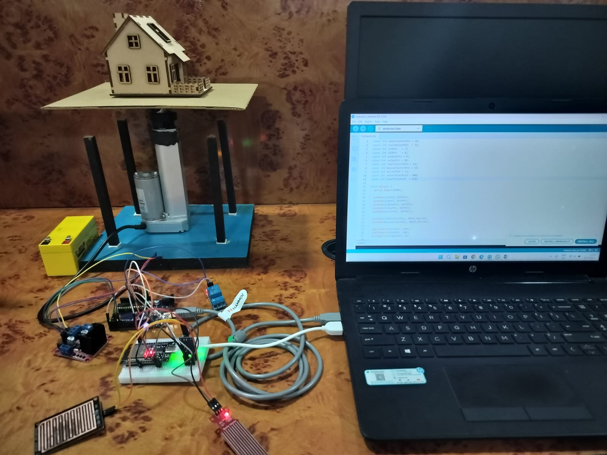

# Flood Resistant System Using Hydraulic Lift

## Project Model
 

## Project Overview
->The Flood Resistant System is an IoT-based solution designed to protect homes and property during flood emergencies.  
->The system detects rising water levels using sensors and automatically activates a hydraulic lift mechanism to elevate the structure to a safer height.
->This project focuses on disaster management, real-time monitoring, and automated safety response.

## Objective
- To reduce property damage during floods.
- To design an automated elevation system using hydraulic technology.
- To implement real-time flood detection using IoT components.

## Technologies & Components Used
- Arduino UNO
- Water Level Sensor
- Rain Sensor
- Hydraulic Actuator & Pump
- ESP32 (IoT Monitoring)
- Relay Module
- Power Supply Unit
- Embedded C (Arduino Programming)

## How the System Works
1. The water level sensor continuously monitors the surrounding water level.
2. When the water crosses a predefined threshold, the controller receives a signal.
3. The hydraulic lift mechanism is activated automatically.
4. The structure elevates to prevent flood damage.
5. IoT module can send monitoring updates (if integrated).

## Key Features
- Automatic flood detection
- Hydraulic lift-based elevation system
- Real-time monitoring capability
- Disaster safety support mechanism
- Manual override and safety shutoff option.

## Learning Outcomes
- Practical exposure to IoT-based system design
- Understanding of hydraulic mechanisms
- Experience in sensor integration and embedded programming
- Improved problem-solving and system design skills

## Future Enhancements
- Mobile app integration for alerts
- AI-based flood prediction system
- Solar-powered backup support
- Cloud-based monitoring dashboard

## Developed By
**Hemavathy B**  
B.E Computer Science Engineering  
Panimalar Engineering College (2023–2027)

## Contact
Email: harinihemavathy122@gmail.com  
LinkedIn: https://www.linkedin.com/in/hemavathy21  
